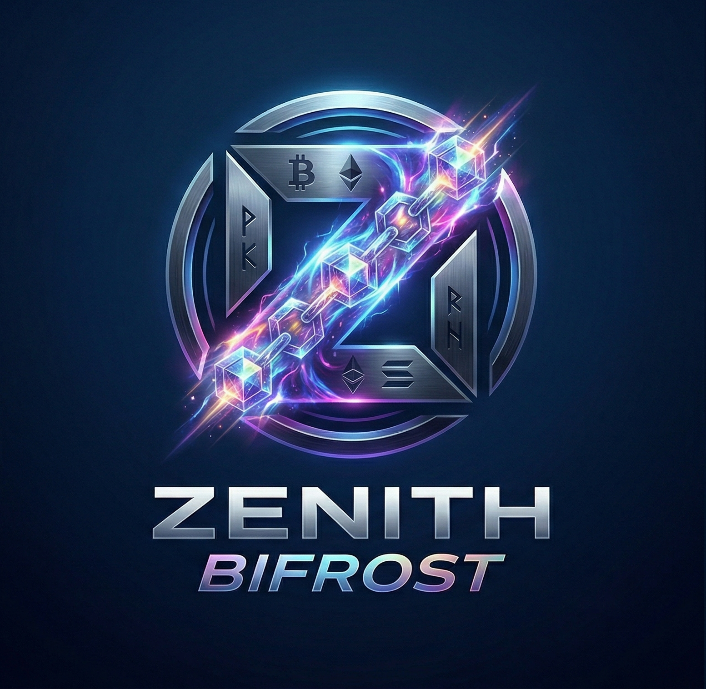

<p align="center">
  
</p>

<h1 align="center">Zenith Bifrost</h1>

<p align="center">
  Service Node.js de surveillance multi-cryptomonnaies avec alertes Telegram, basé sur <a href="https://www.coingecko.com/">CoinGecko</a>.
</p>

## Fonctionnalités

- 📊 Surveillance de **n'importe quelle crypto** supportée par CoinGecko
- 🔔 **Alertes Telegram** configurables par seuil
- ⬆️⬇️ Détection de franchissement **haussier** (`above_or_equal`) et **baissier** (`below_or_equal`)
- 🔄 **Notification de recovery** quand le prix revient dans la zone opposée
- ⏱️ **Cooldown** par seuil pour éviter le spam
- 💾 **État persistant** — redémarrage sans perte d'historique
- 🩺 **Health server HTTP** optionnel
- 📝 **Logs structurés** en JSONL
- 🔧 **Rechargement à chaud** de la config via `SIGHUP`
- ✅ Compatible **PM2** pour la production

## Architecture

```
gozen-zenith-bifrost/
├── src/
│   ├── index.js              # Point d'entrée CLI
│   ├── config-loader.js      # Chargement et validation de la config
│   ├── watcher.js             # Logique principale des cycles
│   ├── state-store.js         # Persistance de l'état
│   ├── logger.js              # Logs structurés JSONL
│   ├── health-server.js       # Serveur HTTP de santé
│   ├── utils.js               # Utilitaires divers
│   ├── price-provider/
│   │   └── coingecko.js       # Provider de prix CoinGecko
│   └── notifiers/
│       └── telegram.js        # Notifications Telegram
├── config/
│   └── watcher.config.example.json  # Exemple de configuration
├── runtime/                   # (généré) État et santé
├── logs/                      # (généré) Logs applicatifs
├── scripts/
│   ├── install.sh             # Script d'installation
│   └── setup-pm2-logrotate.sh # Configuration logrotate PM2
├── ecosystem.config.js        # Configuration PM2
├── .env.example               # Variables d'environnement
└── package.json
```

## Installation

### Prérequis

- Node.js >= 18
- Un bot Telegram (voir section [Configuration Telegram](#configuration-telegram))

### Installation rapide

```bash
chmod +x scripts/install.sh
./scripts/install.sh
```

Ou manuellement :

```bash
npm install
cp .env.example .env
cp config/watcher.config.example.json config/watcher.config.json
mkdir -p logs runtime
```

## Configuration

### Variables d'environnement (`.env`)

| Variable | Requis | Description |
|---|---|---|
| `TELEGRAM_BOT_TOKEN` | ✅ | Token du bot Telegram |
| `TELEGRAM_CHAT_ID` | ✅ | ID du chat pour les notifications |
| `CONFIG_PATH` | ❌ | Chemin vers le fichier de config (défaut: `./config/watcher.config.json`) |
| `HEALTH_PORT` | ❌ | Port du serveur de santé (défaut: `8787`) |

### Fichier de configuration (`config/watcher.config.json`)

```json
{
  "app": {
    "name": "zenith-bifrost",
    "intervalSec": 60,
    "quoteCurrency": "eur",
    "timezone": "Europe/Paris",
    "enableHttpHealth": true,
    "healthPort": 8787,
    "defaultCooldownSec": 3600
  },
  "notifications": {
    "telegram": {
      "enabled": true,
      "parseMode": "Markdown"
    }
  },
  "watchers": [
    {
      "id": "tao-main",
      "enabled": true,
      "coinId": "bittensor",
      "symbol": "TAO",
      "quoteCurrency": "eur",
      "thresholds": [
        {
          "name": "first-sell-target",
          "direction": "above_or_equal",
          "price": 310.48,
          "cooldownSec": 3600,
          "notifyOnRecovery": true,
          "messageTemplate": "🔔 TAO a atteint le premier palier : {{price}} {{currency}} (objectif {{threshold}})."
        }
      ]
    }
  ]
}
```

### Options de threshold

| Champ | Type | Description |
|---|---|---|
| `name` | string | Nom unique du seuil (dans le watcher) |
| `direction` | string | `above_or_equal` ou `below_or_equal` |
| `price` | number | Prix seuil |
| `cooldownSec` | number | Délai minimum entre deux alertes (secondes) |
| `notifyOnRecovery` | boolean | Notifier quand le prix revient hors de la zone |
| `messageTemplate` | string | Template personnalisé (optionnel) |

### Variables de template

Les templates de messages supportent : `{{symbol}}`, `{{thresholdName}}`, `{{price}}`, `{{currency}}`, `{{threshold}}`, `{{timestamp}}`.

## Configuration Telegram

### 1. Créer un bot

1. Ouvrez [@BotFather](https://t.me/BotFather) sur Telegram
2. Envoyez `/newbot` et suivez les instructions
3. Copiez le **token** dans `TELEGRAM_BOT_TOKEN`

### 2. Trouver le Chat ID

**Option A** — Commande intégrée :

1. Envoyez un message à votre bot sur Telegram
2. Exécutez :
```bash
npm run get-chat-id
```
3. Copiez l'ID affiché dans `TELEGRAM_CHAT_ID`

**Option B** — Pour un groupe, ajoutez le bot au groupe, envoyez un message, puis relancez `get-chat-id`.

### 3. Tester la connexion

```bash
npm run test-telegram
```

Vous devriez recevoir un message de confirmation dans Telegram. ✅

## Commandes utiles

```bash
# Démarrage normal
npm start

# Démarrage en mode développement (avec --watch)
npm run dev

# Exécuter un seul cycle
npm run once

# Tester la connexion Telegram
npm run test-telegram

# Trouver le Chat ID
npm run get-chat-id

# Avec un fichier de config spécifique
node src/index.js --config ./config/custom.json

# Avec PM2
pm2 start ecosystem.config.js
pm2 status
pm2 logs zenith-bifrost
pm2 restart zenith-bifrost

# Recharger la config à chaud (SIGHUP)
pm2 sendSignal SIGHUP zenith-bifrost
```

## Health Server

Si `enableHttpHealth: true` dans la config, un serveur HTTP démarre sur le port configuré.

| Route | Description |
|---|---|
| `GET /health` | État de santé (dernier cycle, durée, erreurs) |
| `GET /state` | Résumé de l'état des watchers (sans données sensibles) |
| `GET /config` | Configuration sanitizée (sans secrets) |

Exemple :
```bash
curl http://localhost:8787/health
```

## PM2

### Démarrage

```bash
pm2 start ecosystem.config.js
```

### Logrotate

```bash
chmod +x scripts/setup-pm2-logrotate.sh
./scripts/setup-pm2-logrotate.sh
```

Configure la rotation automatique des logs PM2 (10 Mo max, 14 rotations, compression).

## Logs

Logs structurés au format JSONL dans `logs/events.jsonl`.

Chaque ligne est un objet JSON avec au minimum :
- `ts` — Timestamp ISO
- `level` — `info`, `warn`, `error`, `fatal`
- `event` — Nom de l'événement

Événements principaux : `service_start`, `config_loaded`, `cycle_start`, `cycle_complete`, `price_fetch_success`, `threshold_triggered`, `threshold_recovered`, `notification_sent`, `notification_failed`.

## Licence

MIT — Projet open source développé par [Gozen Consulting](https://gozen-consulting.com/).
